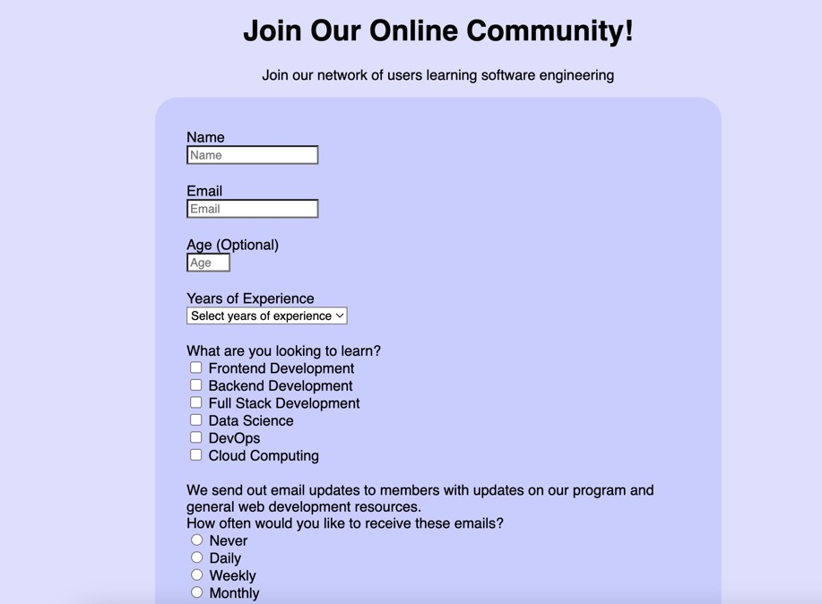

# fcc-survey-form

Live Site: [Simple Survey Form](https://kaykaym01.github.io/fcc-survey-form/)

Challenge Description: [FreeCodeCamp: Responsive Web Design Survey Form](https://www.freecodecamp.org/learn/responsive-web-design/responsive-web-design-projects/build-a-survey-form)

This project is a part of FreeCodeCamp's Responsive Web Design course. The challenge is to create a survey form similar to this: https://codepen.io/freeCodeCamp/full/VPaoNP

Required Elements:
* Form Element
* Name Element
* Email Element
* Number Element
* Radio Button Elements
* Text Area Element
* Element Labels

Skills Demonstrated:
* HTML
* CSS
